# 入门篇

[[TOC]]

> 以南昌 6C 综合分析，鸟害按线分布展示为例。

#### 报表展示效果

1. #### 定义数据库连接

服务器 ->定义数据连接

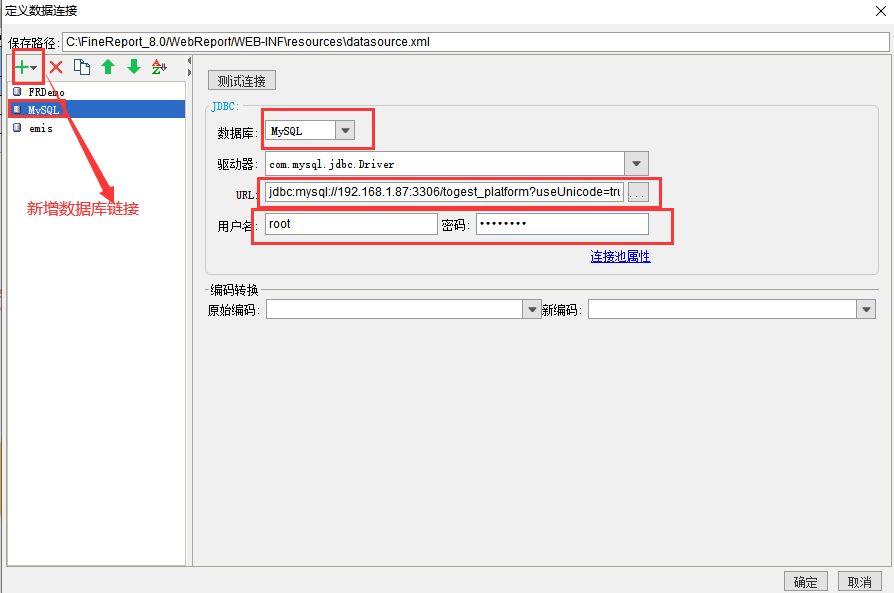

2. #### 新增工作簿

文件 ->新建工具簿

3. #### 新增模板数据集

3.1. 数据集中最常用的是数据库查询、内置数据集。

3.1.1. 数据库查询数据集（开发报表的主数据 sql、选择组件的 sql、字典的 sql）

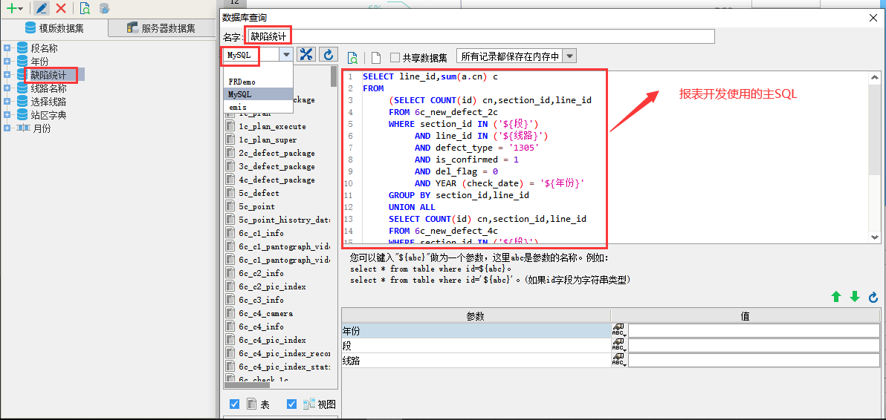

3.1.2. 内置数据集（数据库里的数据不能满足业务需求，如按业务字段排序）

4. #### 选择组件

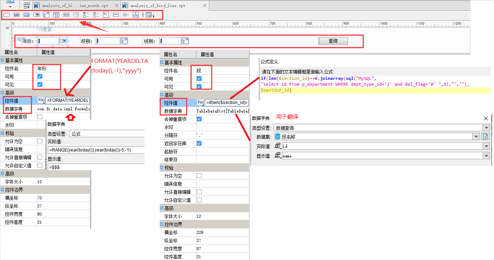

4.1. 日期组件（格式可以自己定义）

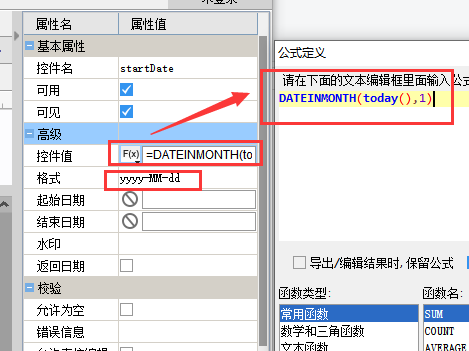

4.2. 段别

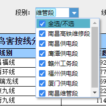

4.3. 模板数据集参数接收

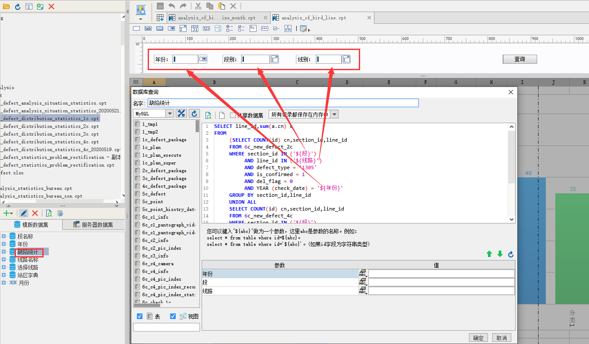

5. #### 报表开发

5.1. 表格

将数据集中字段拖到对应的表格中。数据设置中有分组、列表、汇总

分组：相同 id 合并展示

列表：按列表详细展示

汇总：用于数学计算

5.1.1. 表格字段设置

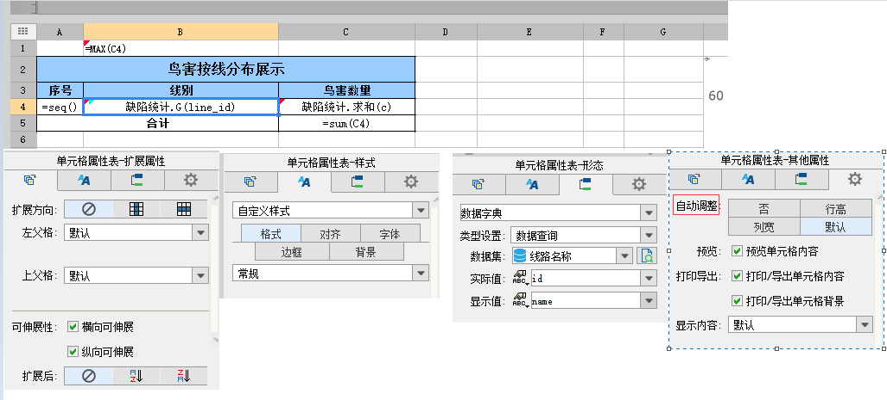

5.1.1.1. 扩展属性

用于展示数据的扩展方向(横向、纵向)，可以自定义随哪个单元格扩展。

5.1.1.2. 样式

可以设置单元格数据字体大小、颜色、边框、百分比、小数点几位等

5.1.1.3. 形态

用于翻译单元格中的数据，普遍用字典。因为单元格中的字段普遍是数据库中的 id,用字典翻译展示。

5.1.1.4. 其他属性

单元格显示的大小可以固定，也可以随单元格中的内容改变

5.1.1.5. 数据列操作（双击单元格）

5.1.1.5.1. 过滤，对单元格中字段再次进行调节过滤

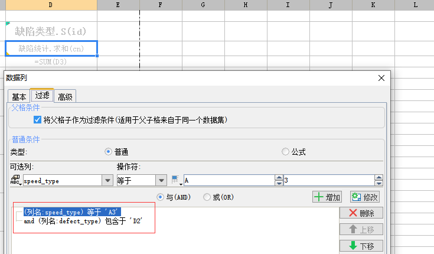

5.1.1.5.2. 高级，对单元格中的值进行处理，如：

5.1.1.6. 条件属性（鼠标右击，条件属性）

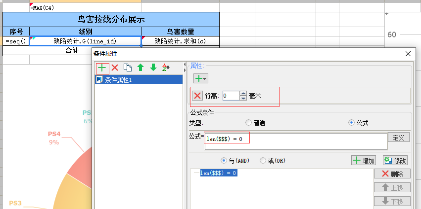

5.1.1.7. 固定标题

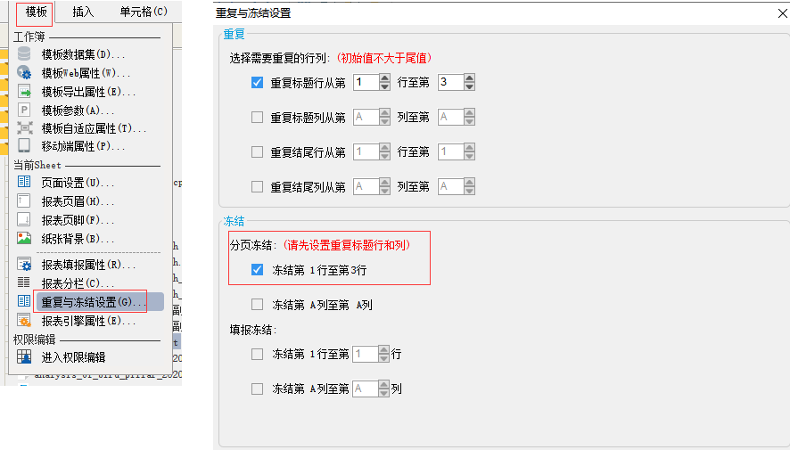

5.2. 图表

5.2.1. 饼状图

5.2.1.1. 效果图

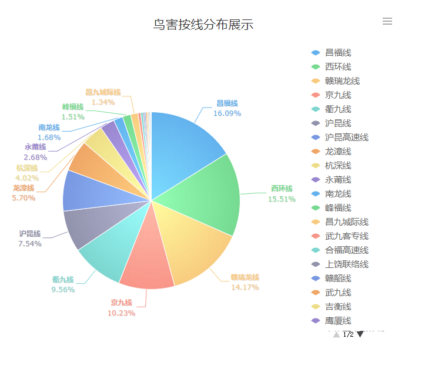

5.2.1.2. 图表属性表-数据

数据来源：数据集数据(来源于模板数据集)、单元格数据(表格中的某个单元格)。

系列名：饼状效果图右边的线路。在形态中可以设置字典，用于法师系列名。

值：数据集数据对应的是某个字段，单元格数据对应的是某个单元格。

5.2.1.3. 图表属性边-样式

主要设置是标签和提示

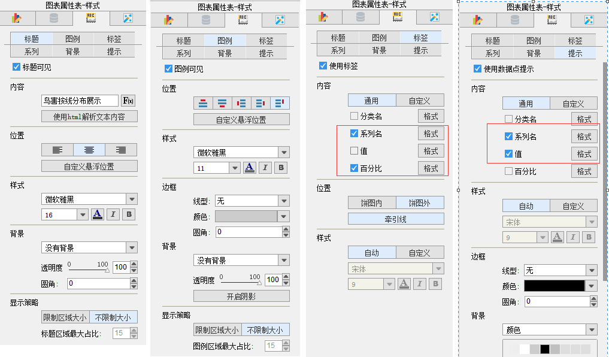

5.2.2. 柱状图

5.2.2.1. 效果图

5.2.1.2. 图表属性表-数据

数据来源：数据集数据(来源于模板数据集)、单元格数据(表格中的某个单元格)。

系列名：饼状效果图右边的线路。在形态中可以设置字典，用于法师系列名。

值：数据集数据对应的是某个字段，单元格数据对应的是某个单元格。

5.2.1.3. 图表属性边-样式

主要设置是标签、坐标轴、提示

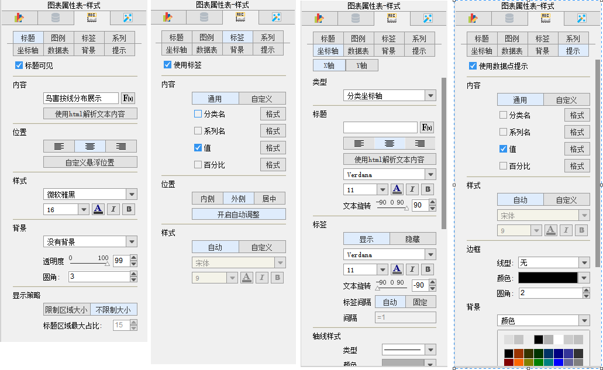

5.3. 预览

对应 3 中预览方式：数据分析、分页预览、填报预览。使用最多是数据分析、其次分页预览。不同预览方式，对应请求 URL 是不一样的，预览效果也不同。

5.3.1.数据分析

5.3.2.分页预览

用于数据量比较大时，浏览器不至于崩溃。

一页显示的数量可以设置，模板 --> 表报引擎属性。但是一般不用，使用这个会影响模板的一些功能。可以手动设置

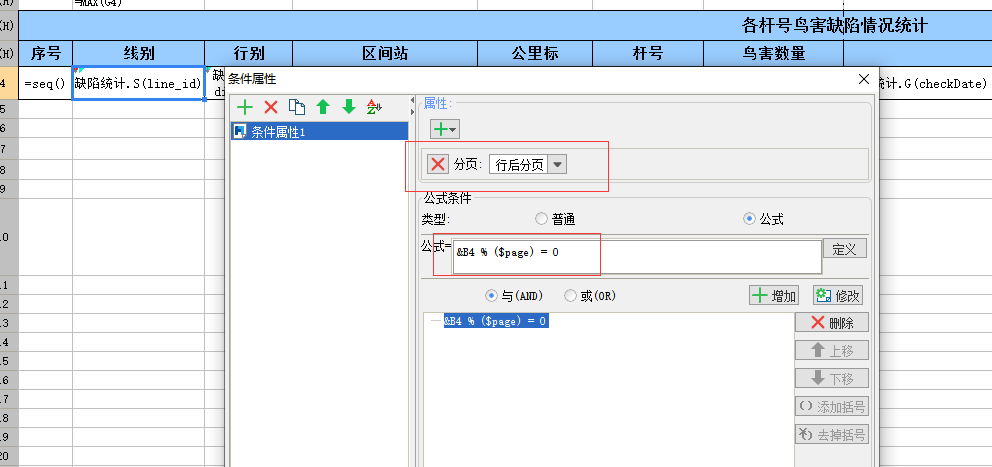

模板数据列较多时，分页显示不全，可以在 URL 上加：&**bypagesize**=false 这个属性。

5.4. 自定义模板

模板 - -> 模板 Web 属性

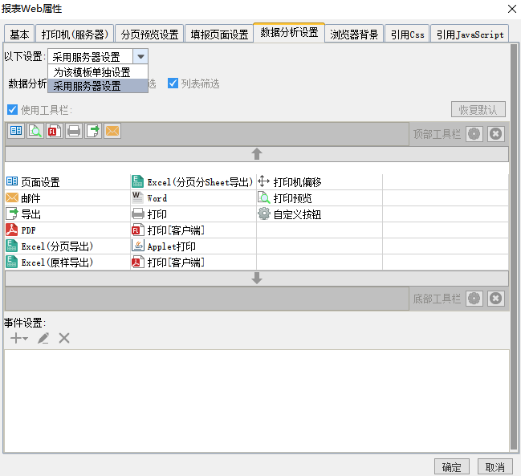

配置想要的模板

5.5. 导出数据

5.6. 菜单配置

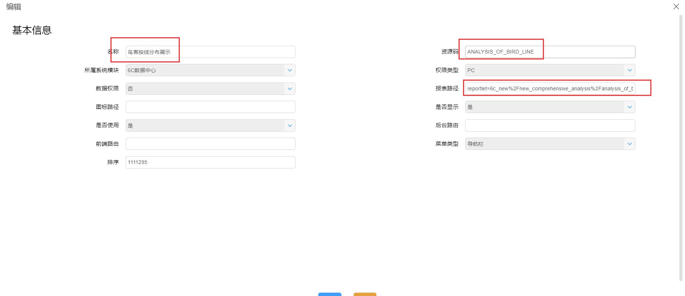

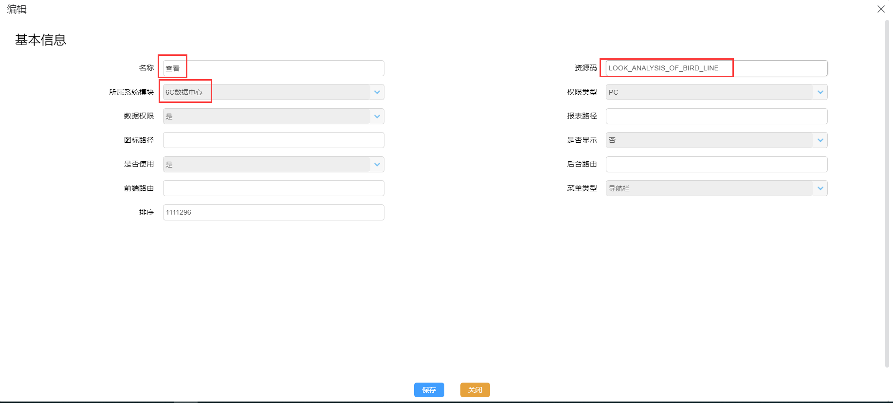

5.6.1. 系统表报效果

5.7. 调试

开发时，使用 debug 模式,可以快速定位错误问题。

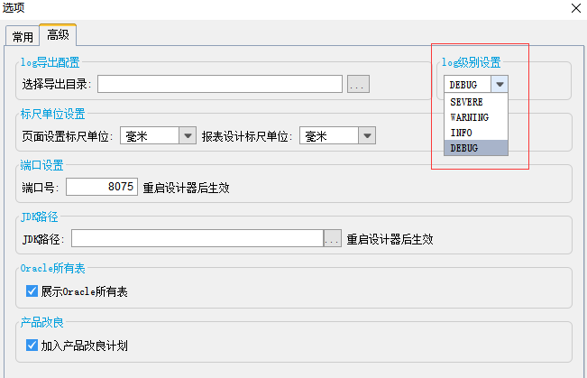

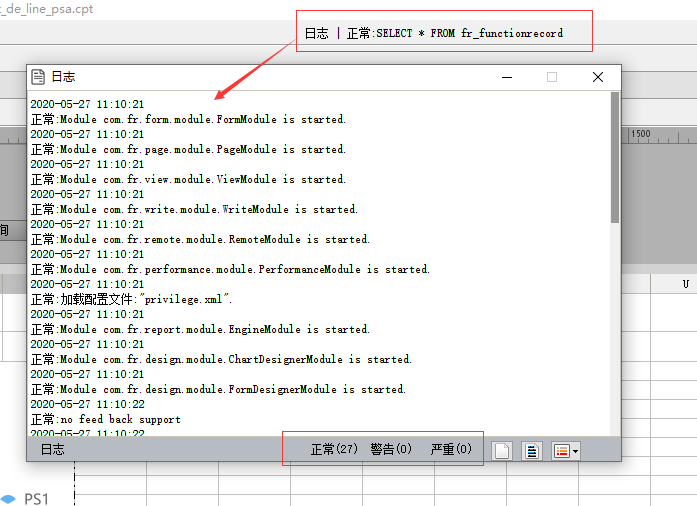
