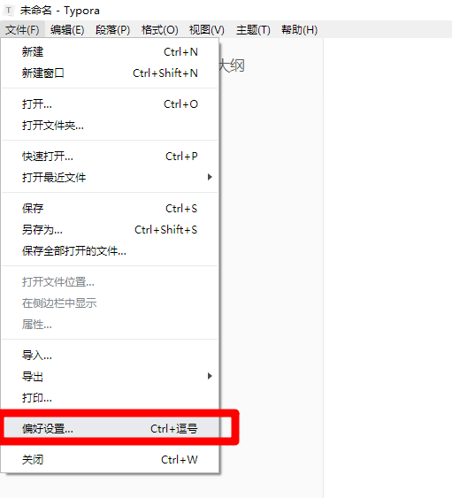

---
title:test2
---

# 文档编写规则

## 0. 语法规范

- [标准的 markdown 语法](https://markdown-zh.readthedocs.io/en/latest/)

- vuepress[扩展语法](https://vuepress.vuejs.org/zh/guide/markdown.html)(使用 vuepress 及其工具链时可预览,其他不支持)

- vue 风格的[流程图](https://flowchart.vuepress.ulivz.com/#syntax)(使用 vuepress 及其工具链时可预览,其他不支持)

- 还可以扩展...

## 1. 命名约定

- 所有的文件和文件夹均以英文命令,不区分大小写,以中横线`-`作为分隔符

## 2. 导航和侧边栏配置

### 导航: `docs\nav.json`

- [完整规则](https://vuepress.vuejs.org/zh/theme/default-theme-config.html#%E5%AF%BC%E8%88%AA%E6%A0%8F)

### 侧边栏: `docs\sidebar.json`

> 侧边栏本质上是将已有的文件路径映射 到侧边栏显示的标题上,因此侧边栏的数据是文件路径的列表, 侧边栏分组则是将部分列表数据合写成对象

- 路径列表生成侧边栏链接 > 直接在`sidebar.json`中写文件路径,默认的链接文字是 取文件内容的`#一级标题` 和`##二级标题`
  > 显示地指定链接的文字，使用一个格式为 [link, text] 的数组
      	
```json
[
  "",            // 以 / 结尾则代表 README.md
  "文件名1",      // 有效的文件路径(可以省略上级已有的路径)
  "路径/文件名3"  // 有效的文件路径(可以省略上级已有的路径)
  ["路径/文件名3","显示的名字"]
]
```
- 侧边栏分组配置:(可选的)

  ```json
  {
    "title": "分组名称", // 必要的
    "path": "//", // 可选的, 应该是一个绝对路径
    "sidebarDepth": 0, // 可选的, 显示的侧边栏深度(默认为1,显示文件内容的`#标题` 和`##二级标题`)
    "collapsable": false, // 可选的,默认展开, 默认值是 true,
    "children": [
      // 子级的配置列比
      "", // 以 / 结尾则代表 README.md
      "文件名1", // 有效的文件路径(可以省略上级已有的路径)
      "路径/文件名3" // 有效的文件路径(可以省略上级已有的路径)
    ]
  }
  ```

## 3. 静态资源引用

- 网络资源
- 本地资源 - 使用 `./` 形式的**相对路径**引用资源 - 复制资源到 markdown 附近的相关目录
  > typora 配置自动复制文件配置  
