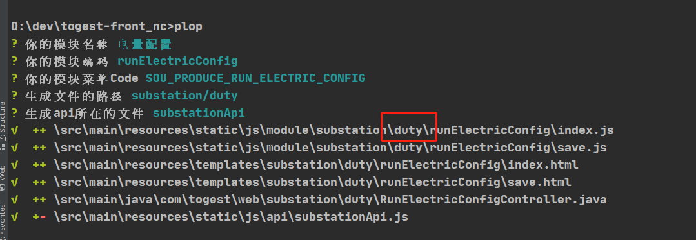

# 前端代码生成器:plop

1. 全局安装代码生成器 plop `npm install -g plop`

2. 安装完成后在项目根目录打开命令行,执行命令 `plop`

3. 输入业务特征变量及相应路径即可生成通用代码,以下是模板`module`的特征参数

   | 特征变量            | 说明                                                   |
   | ------------------- | ------------------------------------------------------ |
   | 你的模块名称        | 生成注释,界面文字等                                    |
   | 你的模块编码        | 资源码,后端提供                                        |
   | 你的模块菜单 Code   | 模块按钮的父级菜单编码                                 |
   | 生成文件的路径      | 目标路径,相对于`src/main/resources/static/js/module`   |
   | 生成 api 所在的文件 | 修改目标文件,相对于`src/main/resources/static/js/api/` |

4. 生成文件包括列表、controller、保存页面；api文件从前面更新，列表有基础的走资源的增删改查导入导出搜索；

例子：变电管理（substation）-值守(duty)-电量配置(runElectricConfig-资源码)

