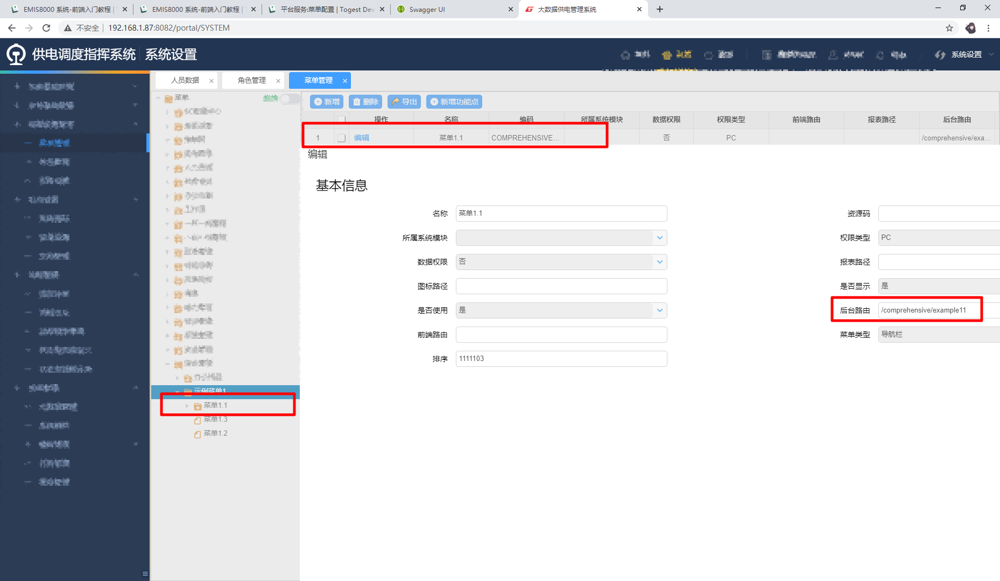

# `EMIS8000`前端教程

> 业务研发 EMIS8000

[[TOC]]

## 1. 课前准备

### 1.1 我们会做出什么东西?

- 常见的业务 CURD 页面,包括但不限于列表,新增,编辑,详情等页面

### 1.2 前置知识

- 了解 spring mvc 的 controller [手册](https://www.w3cschool.cn/spring_mvc_documentation_linesh_translation/spring_mvc_documentation_linesh_translation-7z6u27rb.html)
- 了解 requirejs AMD 规范 [入门](https://www.ruanyifeng.com/blog/2012/11/require_js.html) [API](https://requirejs.org/docs/api.html)
- 熟悉 easyui 的 datagrid,dialog 组件 API [下载链接](https://pan.baidu.com/s/1d0bct3_Pwwcb7XlAkUAEEQ) 提取码：aug3

- 熟悉 vue 基础 API [教程](https://cn.vuejs.org/v2/guide/)
- 熟悉 element-ui 常见组件的 API [官网](https://element.eleme.cn/#/zh-CN/component/installation)

## 2. 环境准备

- 安装 jdk1.8 [下载](https://pan.baidu.com/s/1sjnP8QTEnYKGFEoDvu9S2g) 提取码：s8b4
- 安装 svn 小乌龟 [下载](https://tortoisesvn.net/downloads.zh.html) 安装时一定要勾选命令行接口
- 安装 idea [下载](https://pan.baidu.com/s/1KpRN9T_X2KFwhTVjSeW3mQ) 提取码：43hy
- Node.js 10+ 和 NPM 包管理器 [官网](https://nodejs.org/zh-cn/)
- idea 安装 Lombok 插件 [?](https:www.baidu.com)
- 使用 svn 小乌龟下载项目
- idea 导入项目
- 配置 idea 热更新 [?](https:www.baidu.com)

## 3. 添加一个业务功能

@flowstart
st=>start: 开始
e=>end: 结束
requirement=>parallel: 需求定义菜单和模型
menu=>operation: 配置菜单
code=>operation: 生成代码
link=>operation: 指定路由嵌入菜单
debug=>operation: 调试功能
pack=>operation: 打包部署
test=>operation: 功能测试
bug=>condition: 缺陷?

st->requirement
requirement(path1,left)->menu
requirement(path2,bottom)->code
menu->link
code->link
link->debug->pack->test->bug
bug(no,bottom)->e
bug(yes,right)->debug

@flowend

### 3.1 需求定义菜单和模型(运营提供)

- 明确的菜单设计,包括模块归属及左侧菜单树的结构和各个按钮的设计
- 明确的字段设计,需要知道列表,新增,编辑,详情等各个状态字段的状态及其中的关联逻辑

### 3.2 配置菜单及按钮权限树

> 请参阅 [平台服务:权限管理](../web-application/base/menu-config.md)

### 3.3 代码生成器生成初始代码

> 请参阅 [代码生成器](../dev-tools/front-code-maker.md)

### 3.4 指定路由嵌入菜单

- 菜单树里页面对应右侧空白区域一个嵌入的 iframe 页面,这个页面通过后端路由地址渲染出来
- 该地址通过 菜单表单里的**后端路由**来设置指定的页面
- 至此业务的基本界面已经完成,重新登陆系统即可看到效果

## 4. 调试功能

### 4.1 理解后端路由到 JS 脚本

> 理解页面系统是如何运作的

#### 4.1.1 路由->模板

> 在`src/main/java/com.togest.web`下找到对应控制器文件

- 注意:模板 html 页面一定不能是绝对路径,部署在 Linux 服务器上时,会找不到模板文件

```java
package com.togest.web.comprehensive;

import com.togest.entity.request.FormParamRequest;
import com.togest.util.HandleParamsUtil;
import org.springframework.stereotype.Controller;
import org.springframework.ui.Model;
import org.springframework.web.bind.annotation.RequestMapping;

@Controller
public class example {

    //示例页面 列表页
    @RequestMapping(value = "/comprehensive/example")
    public String ProActiveIndex(Model model) {
        return "comprehensive/example/index";
    }

    //示例页面 新增编辑页面
    @RequestMapping(value = "/comprehensive/example/save")
    public String ProActiveSave(Model model, FormParamRequest entity) {
        model.addAttribute("data", HandleParamsUtil.formParamRequestTryData(entity));
        return "comprehensive/example/save";
    }

    //示例页面 详情页面
    @RequestMapping(value = "/comprehensive/example/detail")
    public String detail(Model model, FormParamRequest entity) {
        model.addAttribute("data", HandleParamsUtil.formParamRequestTryData(entity));
        return "comprehensive/example/detail";
    }
}
```

#### 4.1.2 模板->Javascript

- 模板文件放在`src/main/resources/templates`下与功能对应的目录下
- script 使用 require.js 引入对应的功能 JavaScript 代码
- 注意 script 使用特殊的`thymeleaf`语法处理 JavaScript 代码的缓存问题

```html
<!DOCTYPE html>
<html lang="en" xmlns:th="http://www.thymeleaf.org">
  <head>
    <meta charset="UTF-8" />
    <meta
      name="viewport"
      content="width=device-width, initial-scale=1, maximum-scale=1, user-scalable=no"
    />
    <meta http-equiv="X-UA-Compatible" content="ie=edge,chrome=1" />
    <meta name="renderer" content="webkit" />
    <meta http-equiv="pragma" content="no-cache" />
    <meta http-equiv="expires" content="0" />
    <meta http-equiv="pragma" content="no-cache" />
    <meta http-equiv="Cache-Control" content="no-cache, must-revalidate" />
    <meta http-equiv="expires" content="0" />
    <script
      th:src="@{/plugs/require.js}"
      th:data-main="@{/js/module/comprehensive/example/index.js}"
    ></script>
    <title></title>
    <style>
      [v-cloak] {
        display: none;
      }
    </style>
  </head>
  <body>
    页面内容
  </body>
</html>
```

#### 4.1.3 `javascript` 脚本

> 写大部分业务逻辑的位置

- AMD 模块化语法

- 常见的依赖:

  > 所有这些依赖名称都注册在 `static/js/config/require.config.js`

| 依赖名称                                        | 描述                       |
| ----------------------------------------------- | -------------------------- |
| service/api/ajax                                | 数据请求相关的封装         |
| vue/loadsh/moment                               | 第三方 js 库               |
| 组件库 element/MyVue/单个组件                   | 界面 ui 可以使用自定义标签 |
| EasyDialog/EasyTable                            | easyui 封装的 js 库        |
| method/formMethod/statusFlowMethod/handleMethod | 自定义的工具库             |
| userInfo/appConfig                              | js 配置/全局变量信息       |

```javascript
require(["/js/config/requireConfig.js"], function(config) {
  require([
    /*依赖*/
  ], function(/*依赖导入一个变量(可选)*/) {});
});
```

### 4.2 理解如何与服务端交互

> 请参阅 [平台工具:与服务端交互](../web-application/base/ajax-api-service.md)

### 4.3 完善列表页

> - 基于`EasyTable`组件的元数据驱动的新增编辑页面
> - 请参阅:
>   - [平台服务:元数据管理](../web-application/base/easy-table.md)
>   - [业务组件:EasyTable 组件](../web-application/base/easy-table.md)
>   - [列表页-最佳实践](../web-application/business/list-page-best-practice.md)

#### 4.3.1 模式一 标准单表列表及检索

#### 4.3.2 其他模式

### 4.4 完善新增编辑页

> - 基于`TgElSave`组件的元数据驱动的新增编辑页面
> - 请参阅:
>   - [平台服务:元数据管理](../web-application/base/easy-table.md)
>   - [业务组件:TgElSave 组件](../web-application/base/tg-el-save.md)
>   - [表单页面最佳实践]()

### 4.5 补充详情页

> 基于`TgCompDetail`组件的元数据驱动的详情页面

### 4.6 其他页面

- 应该使用以下资源来构建功能
  - [抽象功能]()
  - [平台服务]()
  - [流程框架]()
  - [数据大屏]()

## 5. 打包到上线

### 5.1 打包部署

### 5.2 提交测试

### 5.3 追踪缺陷
