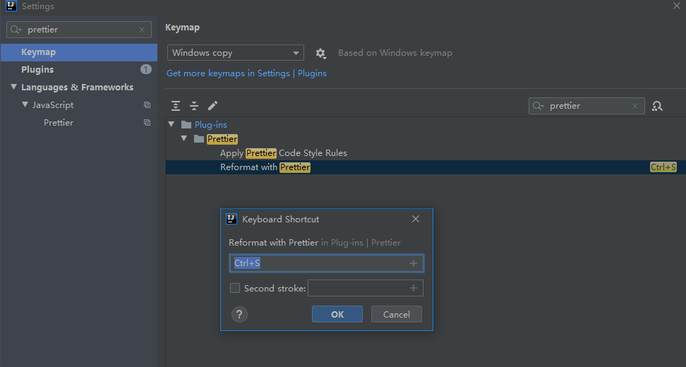

# 平台研发指南（地铁信息化）

> 新项目平台对服务、弹框、api管理、代码生成器plop等方案进行了升级，目的是通过工具升级，提升开发体验和效率，同时提高项目可控性；
>
> 服务和api管理方案的升级，使前端开发人员不需要在关注接口相关的事，所有接口信息由后台决定；
>
> 弹框的升级可以减少对后台路由的依赖，通过组件的形式组织代码，相当于是每个菜单路由对应一个单页面应用，同时弹框服务也提供了iframe的支持；

## 项目初始化

### 前提条件

- jdk11(企业微信-微盘-研发组共享空间-工具-JDK)
- <a href="http://nodejs.cn/download/">nodejs</a>
- svn(企业微信-微盘-研发组共享空间-工具-JDK)
- idea（自行处理）###操作步骤

- svn checkout项目（地址：http://43.227.254.58:3690/svn/XT/Subway/Front/01_source/trunk/pdp-cms-front）

- idea导入项目

- prettier代码格式化设置

  - idea安装prettier插件

  - npm全局安装prettier插件（npm i -g prettier）

  - idea设置prettier插件

    > 设置中搜索prettier，在plugins中设置prettier的可执行文件地址（全局安装使用全局地址，本地安装使用本地地址）
    >
    > 在
    >
    > 建议：格式化快捷键配置如下
    >
    > 

## 开发变更事项

### 服务及api管理

../web-application/base/menu-config.md

- 服务工具从jQuery ajax修改为<a href="http://www.axios-js.com/">axios</a>
- 重新封装服务工具类static/utils/axios.js
- 注意：表格请求服务依旧使用的是jQueryajax（框架限制）
- api管理不再通过手动管理，使用根目录写的工具apiService.js
- 使用方式见使用方式见<a href="../web-application/base/axios-service.md">平台工具:与服务端交互及API工具(地铁信息化)</a>

### 弹框

- 使用通过elementui dialog组件封装的服务组件，使用方式见<a href="../web-application/base/el-dialog-service.md">平台服务：弹框服务</a>

